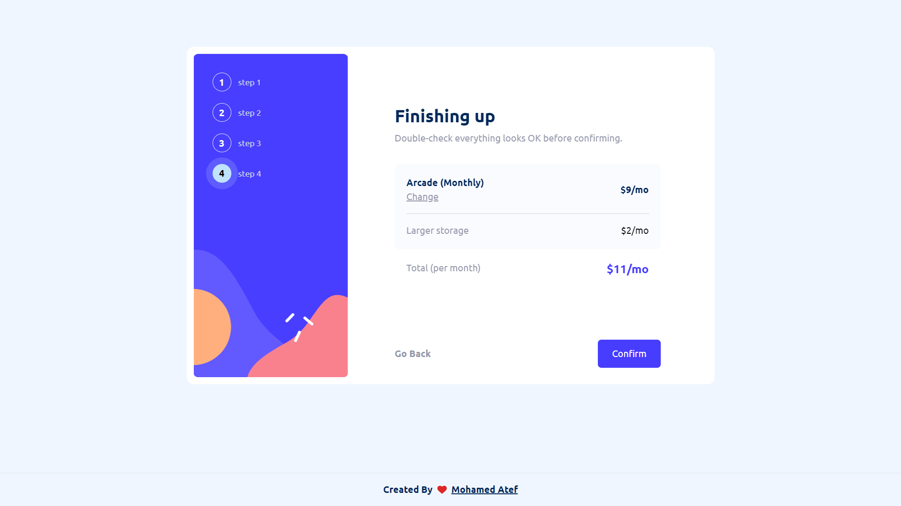

# Frontend Mentor - Multi-step form solution

## Table of contents

- [Frontend Mentor - Multi-step form solution](#frontend-mentor---multi-step-form-solution)
  - [Table of contents](#table-of-contents)
  - [Overview](#overview)
    - [The challenge](#the-challenge)
    - [Screenshot](#screenshot)
    - [Links](#links)
  - [My process](#my-process)
    - [Built with](#built-with)
    - [What I learned](#what-i-learned)
    - [Continued development](#continued-development)
  - [Author](#author)

## Overview

### The challenge

Users should be able to:

- Complete each step of the sequence
- Go back to a previous step to update their selections
- See a summary of their selections on the final step and confirm their order
- View the optimal layout for the interface depending on their device's screen size
- See hover and focus states for all interactive elements on the page
- Receive form validation messages if:
  - A field has been missed
  - The email address phone number or name is not formatted correctly

### Screenshot

### Links

- Solution URL: [Click here](https://github.com/Mohamedate/multi-step-challenge)
- Live Site URL: [live site URL](https://multi-step-ch.vercel.app/)

## My process

- I'm using React Redux to manage all application state. My current challenge is building the project just with Redux for state management, without utilizing routing or any related functionalities.
- I created the root of my Redux store and placed all the state I need for my project within it, including the current form state, such as the login step or selection plan etc.

### Built with

- React js
- Redux
- Tailwind CSS
- Frame Motion

### What I learned

I've learned how to manage state in various project scenarios. This includes understanding how to connect the same state to different components and how to decide whether the state should be globally stored or remain local to a specific component.

### Continued development

I currently focus on React frameworks and the related frameworks surrounding it, such as Next js.How to effectively manage complex state in applications, including handling API requests, important topics in Next js like SSG SSR CSR and more.

## Author

- My website - [Mohamed Atef](https://atef.vercel.app)
- Frontend Mentor - [@Mohamedate](https://www.frontendmentor.io/profile/Mohamedate)
